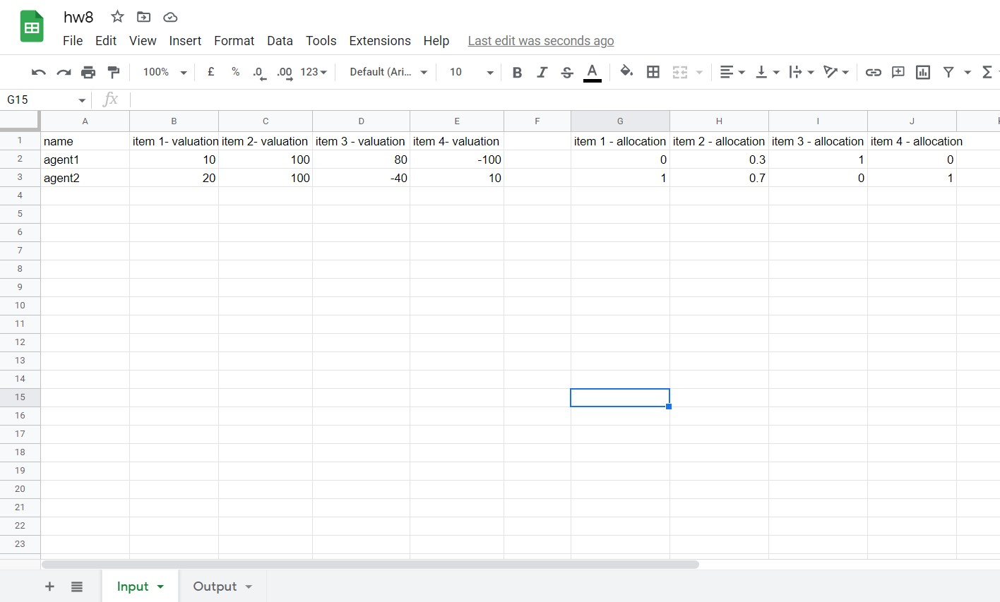
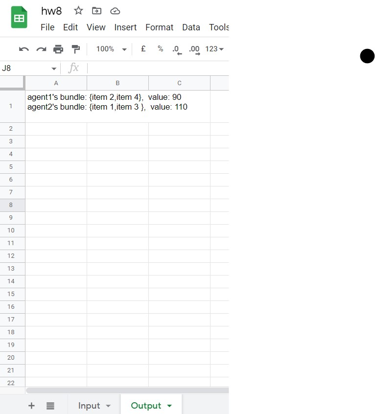
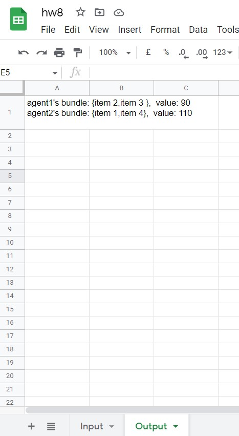
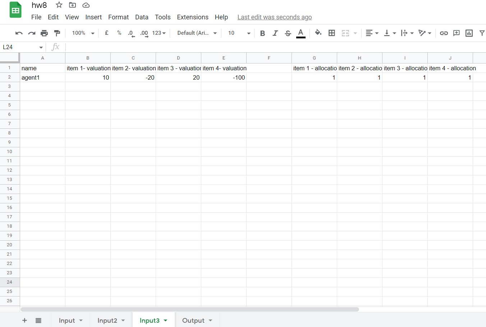
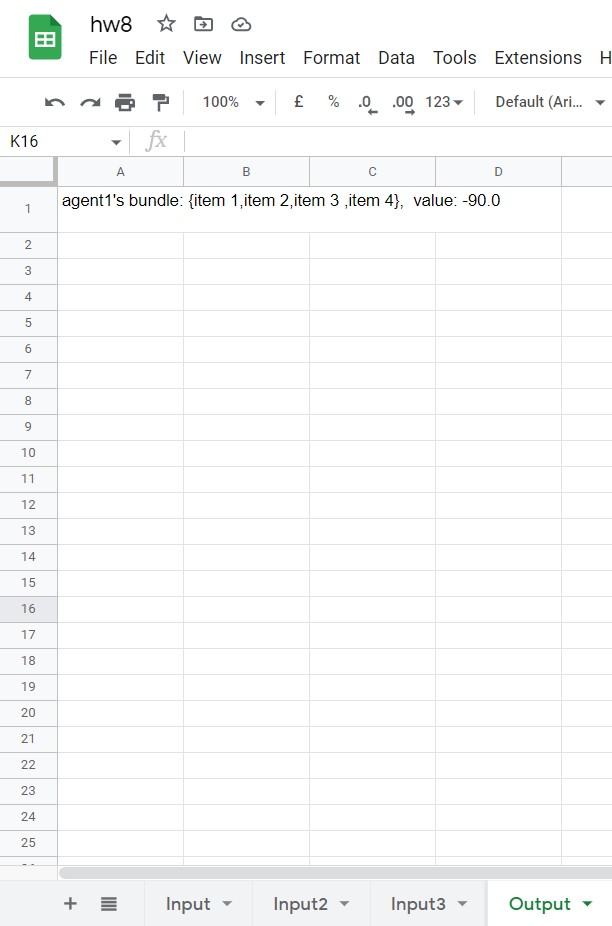
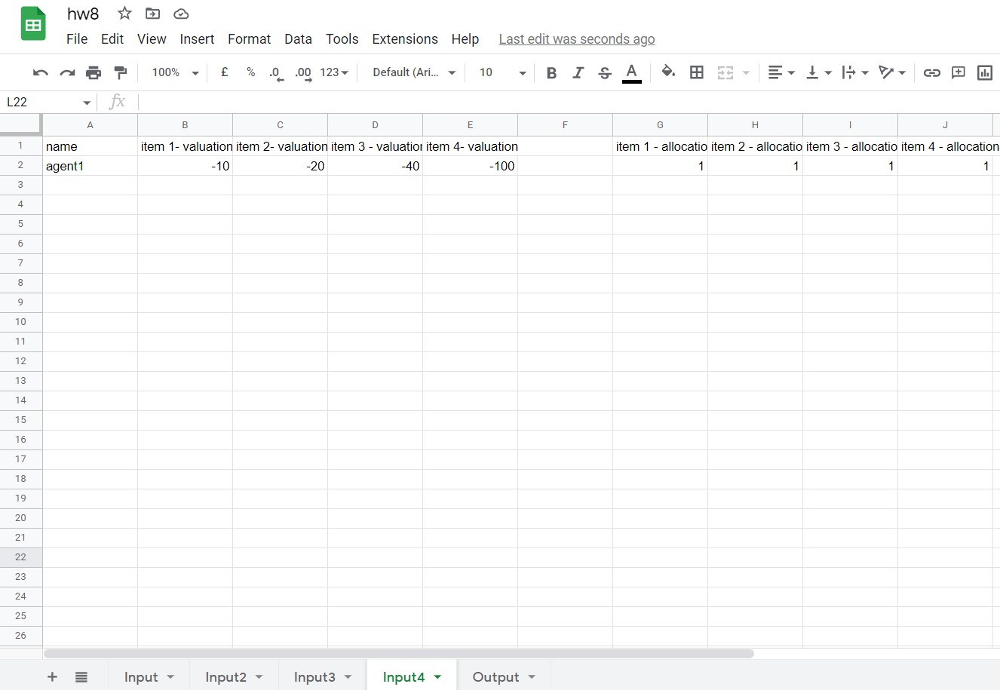
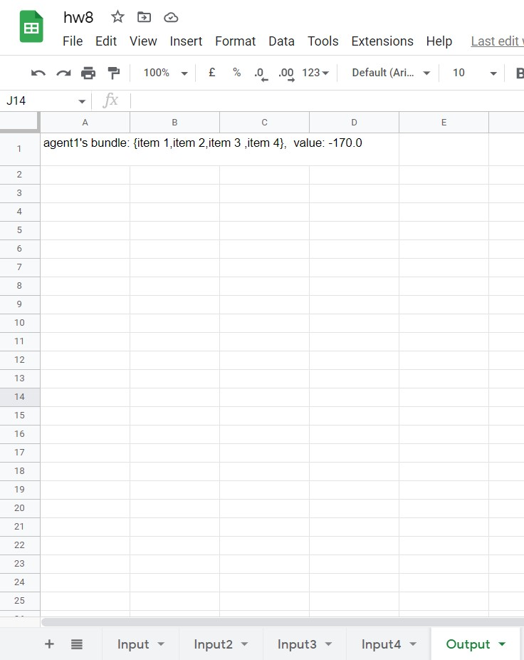

# Input / Output Examples

Current I/O spreadsheet:
https://docs.google.com/spreadsheets/d/1BdSeJ0uOmnJijWa460BmgyjAKBpVFiQ-6QONHN3Ip4U/edit?usp=sharing

## Example 1
Two agents with mixed utilities (negative, positives)
Should both receive a positive result closest to 100.

#### Input

#### Output

 

------

## Example 2
Single agent with positive utilities should get all
the resources

#### Input

#### Output

------

## Example 3
Single agent with mixed utilities should get all
even if negative

#### Input

#### Output

------

## Example 4
Single agent with negative utilities should get all
even if negative

#### Input

#### Output
